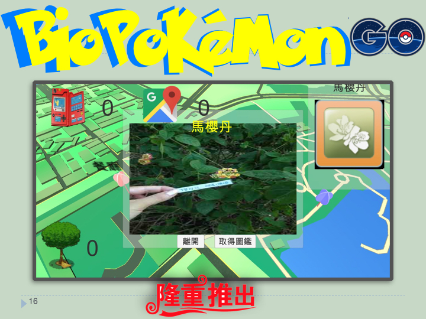

# 2016102930-tbn-hackathon-team7

# 10/29. 10/30 生物多樣性黑客松  

作者: Chiao Yun Chen / 涼涼 / 宗益

##開發指南

1. 安裝Unity 5.x版 [下載網址](https://unity3d.com)

2. 下載專案 [下載網址]https://github.com/hatsukiotowa/2016102930-tbn-hackathon-team7

##執行遊戲

1.打開 Bio Comp Project

2.打開 Assets/GO Map - 3D Map For AR Gaming 開啟 POI - Demo Scene

3.使用 上下左右鍵盤前進，並點選畫面提示按鈕

##相關資料

-生物多樣性黑客松 [網址](http://promo.tbn.org.tw/Home/hackathon)

-Our Slides [Show Slides](#)

-Website Demo [PDF](#)
